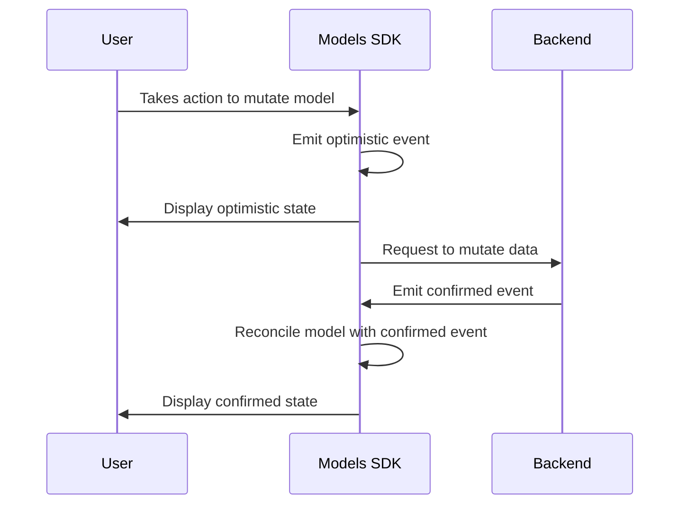
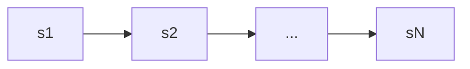
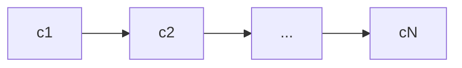
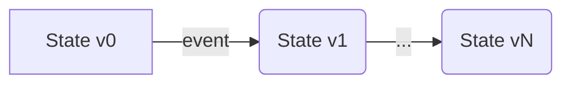
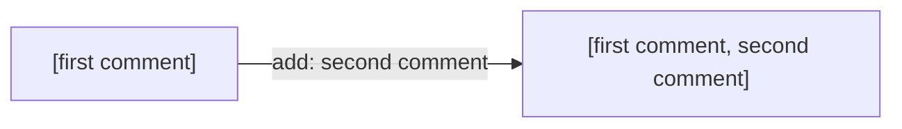

# Concepts

## Overview

The Models SDK aims to make it easier for developers to efficiently and correctly synchronise state from the database to the client in realtime.

- The database is treated as the *source of truth* of the state 
- Alterations to the state take place through your backend APIs
- The client initialises its local copy if the state via your backend APIs
- The client processes a stream of change events from the backend to compute the up-to-date state as it evolves
- The client optimistically applies change events locally when the user mutates the model, and reconciles the optimistic updates with the confirmations from the backend

This allows changes made concurrently by other users or other parts of the system to be continually rendered to the user as part of a reactive, realtime, multiplayer application, while providing a very responsive user experience through local optimistic updates.



## Model State

A *model* is a single instance of a live, observable data model backed by your database.

The data underlying your model (it's "state") is not static; it evolves over time as events occur in the application. Application state follows a linear version history over time:



The library tracks two versions of your model state: its *confirmed* state and its *optimistic* state.

- *Confirmed* state is updated whenever the underlying model data is mutated in your backend.
- *Optimistic* state is updated when the user takes some action to mutate your model locally, before the mutation has been confirmed by the backend.

The purpose of optimistic state is to provide a more responsive user experience. By updating the model immediately in response to user actions, the application feels more interactive and faster. Users don't have to wait for server confirmation before seeing the effects of their actions.

## Change Events

A *change event* describes some action that occurred that mutated the model state. It has a semantic meaning: “like this post”, “add this item” or “bookmark this page”. This is distinct from the state itself, which describes the number of likes on the post, the items in the list or the set of bookmarked pages. Instead, the change event describes an operation that should be applied to the state to transform it from one version to the next, using some data.

A change event can be *confirmed* or *optimistic*:

- *Confirmed* events represent mutations (from any user) that have been applied in the database. They are are emitted by your backend whenever the underlying model data is mutated.
- *Optimistic* events are emitted locally by the library when the user takes some action to mutate the model.

A *confirmed* event is emitted if and only if the mutation in the backend succeeds. Additionally, a sequence of change events are emitted strictly in the order in which their corresponding mutations were successfully committed:



> **Note**
> Ably's [Database Connector](https://github.com/ably-labs/adbc) makes it easy to reliably emit change events over Ably transactionally with mutations to your data in your database.

A change event is delivered to the client over an Ably [*channel*](https://ably.com/docs/channels), i.e. it is an Ably [message](https://ably.com/docs/channels/messages) which consists of the following components:

- An event *name* which describes the semantic meaning of the change event
- A *data* payload which contains the data needed to apply the change

## Update Functions

Change events are applied to the local state to transform it from one version to the next.



The next state is produced by an *update function*, which is a pure function of the previous state and the change event:

```ts
(state, event) => state
```

For example, you might have a data model that represents a list of comments. Adding a new comment is represented by an `add` event:



The update function might therefore be expressed as:

```ts
(state, event) => ({
	...state,
	comments: comments.concat([event.data]), // append the new comment to the existing list
})
```

## Applying Updates to State

Events are applied to model state via update function in the following way:

- The model state is initialised with two copies of the state: an optimistic and a confirmed copy.
- If the incoming event is an *optimistic* event:
  - Apply the optimistic event on top of current optimistic state
  - Set the new optimistic state equal to the result
- If the incoming event is a *confirmed* event:
  - If the incoming event confirms the next expected optimistic event:
    - Discard the optimistic event (i.e. mark it as "confirmed")
  - Apply the confirmed event on top of current confirmed state
  - Set the new confirmed state equal to the result
  - Re-apply any pending optimistic events on top of the new confirmed state
  - Set the optimistic state equal to the result

In this way, optimistic updates are always re-based on top of the latest confirmed state. This means that after applying the confirmed change, the library tries to re-apply the optimistic events in the order they were made.
