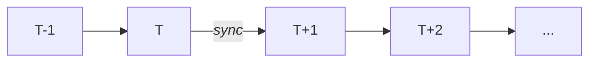
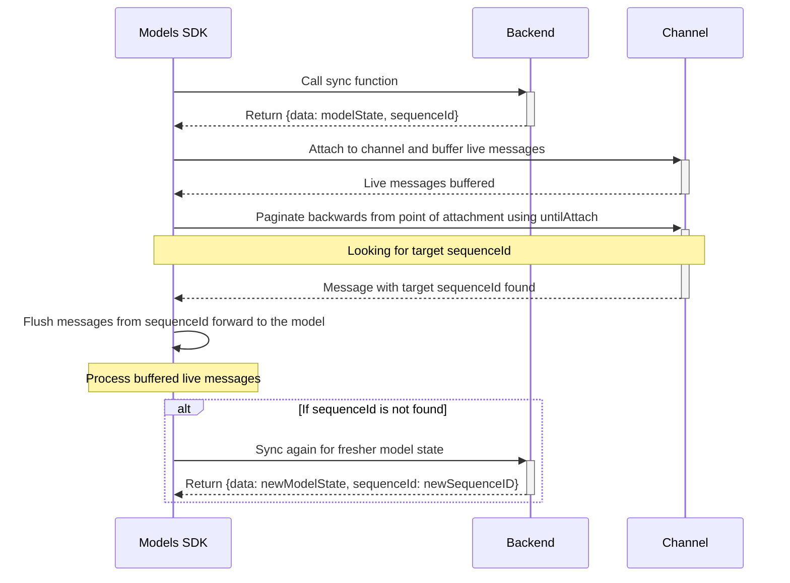

# Replay

When the Models SDK loads your model state via your *sync function*, it is important that we consume change events from your backend from exactly the correct point in the stream. For example, if the state is loaded just after the event at time T is applied, we must replay all events from T+1 onwards.



## Sequence ID

The ID of the confirmation event message describes its position in the stream. In this context, this is referred to as the sequence ID of the change event.

Your sync function must return a `sequenceId` (along with the model state) which describes the position in the stream of change events at which this model state was loaded.

```ts
export type SyncFunc<T, P extends any[] | [] = []> = (...args: P) => Promise<{ data: T; sequenceId: string }>;
```

> Note that if you are using [`adbc`](https://github.com/ably-labs/adbc/), this is the `sequence_id` of the corresponding outbox record, which is a serial integer. The sequence ID to return from your sync function endpoint can therefore be obtained by selecting the largest `sequence_id` in the outbox table. This should be done in the same transaction in which the model state is read from the database.
> 
> ```sql
> SELECT MAX(sequence_id) FROM outbox;
> ```
>
> Note that you should not rely on the sequence itself with e.g. `SELECT nextval('outbox_sequence_id_seq')::integer` as the sequence may be incremented by other concurrent transactions without the effects of those transactions being visible to the transaction that reads the state of the model.


## History

Internally, the SDK uses this sequence ID to replay messages from the correct point in the stream. To do this, the SDK attaches to the channel and subscribes to live messages. Live messages are buffered and not yet processed. It then paginates backwards through history from the point of attachment using [`untilAttach`](https://ably.com/docs/storage-history/history?lang=javascript#until-attach). When a message with the target `sequenceId` is reached, all of the messages from that point forward are flushed to the model to be processed, maintaining continuity with incoming live messages.

If the target `sequenceId` cannot be reached, there is insufficient message history to resume from the correct point and bring the model up to date. The SDK will then try to sync again with a fresher version of the model state by calling your sync function again.




## Message Retention & Caching

The amount of history available to query on the channel is determined by your Ably [message storage](https://ably.com/docs/storage-history/storage) configuration on the channel.

You may wish to cache the model state from the backend endpoint called by the sync function. There is a strict requirement that the model state returned by this endpoint is no older than the message retention period configured on the channel so that the model state can be brought up to date.

Note that if there are no history messages at all on the channel, then the model state is assumed to be brand new with no mutations.
